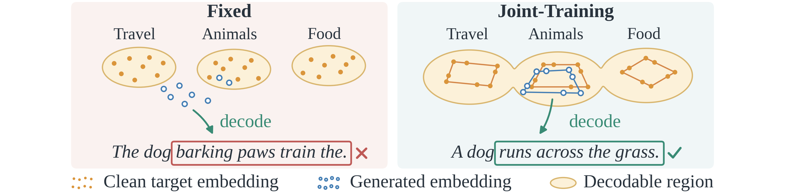

# One Latent, Many Tokens: Jointly Learning Compressed Embeddings for Efficient Language Diffusion

[](https://arxiv.org/abs/2609.33698)

JPEG-DLM (**J**oint-embedding **P**rediction for **E**fficient **G**eneration with **D**iffusion **L**anguage **M**odel) is a diffusion language model that jointly learns compressed embeddings for efficient and reliable text generation. Compression reduces the latent length, with one latent covering several tokens, so each sampling step is cheaper. Instead of fixing the compressed embedding space before training the diffusion model, JPEG-DLM jointly trains a compressor, a flow matching model and a decoding module. With joint-embedding prediction, it learns compressed embeddings that are more structured and easier to model with diffusion. In this way, JPEG-DLM generates compressed embeddings efficiently, and these embeddings can be reliably decoded into tokens, which leads to efficient text generation.

<p align="center">
  
</p>
<p align="center"><em>Fixed (left) and jointly learned (right) compressed embedding spaces.</em></p>

This repository contains the PyTorch implementation of JPEG-DLM. It includes pre-trained checkpoints on LM1B and OpenWebText (OWT) and the scripts to sample from them and evaluate the samples.

## Roadmap

- [x] [2026.09] Release inference code
- [ ] [Coming soon] Release training code

## Setup

Create a conda environment and install the dependencies:

```bash
conda create -n jpeg-dlm python=3.10 -y
conda activate jpeg-dlm
pip install -r requirements.txt
```

## Checkpoints

We provide the checkpoints for [LM1B](https://drive.usercontent.google.com/download?export=download&confirm=t&id=1SdaDFcfoQFEnZYIcFRQvcFxWRHEglbmd) and [OWT](https://drive.usercontent.google.com/download?export=download&confirm=t&id=1ActESuriels9u5kZkjv6P1usNxYIJg5u). Place them in `checkpoints/` as follows:

```text
checkpoints/
├── jpeg_dlm_lm1b_r0.25.safetensors
└── jpeg_dlm_owt1024_r0.5.safetensors
```

The corresponding model configurations are in `configs/`.

## Sampling

To sample from a pre-trained model, pass its checkpoint to the sampling script. You can also change the number of sampling steps with `--steps` and the self-conditioning scale with `--sc-scale`. The commands below use the settings from the paper.

### LM1B

```bash
bash scripts/generate_lm1b.sh --checkpoint checkpoints/jpeg_dlm_lm1b_r0.25.safetensors --steps 32 --sc-scale 3.0
```

### OWT

```bash
bash scripts/generate_owt1024.sh --checkpoint checkpoints/jpeg_dlm_owt1024_r0.5.safetensors --steps 32 --sc-scale 2.0
```

## Evaluation

The evaluation scripts sample with seeds 0 to 4 and report Gen-PPL, entropy and MAUVE. Averaged over the five seeds, they reproduce the results in the paper:

| Dataset | Gen-PPL | Entropy | MAUVE |
|---|---:|---:|---:|
| LM1B | 96.76 | 4.263 | 0.951 |
| OWT | 34.52 | 5.067 | 0.801 |

Gen-PPL is computed with GPT-2 Large; for OWT, an `<|endoftext|>` token is put in front of each sample so that its first token is scored as well. MAUVE uses GPT-2 Large features of the samples and of the 1,024 reference texts in `references/`, both cut to their first 96 (LM1B) or 768 (OWT) GPT-2 tokens, with MAUVE seed 42. The reference texts are packed rows of the LM1B test split and of the OWT training data, decoded with the T5 tokenizer like the samples.

### LM1B

```bash
bash scripts/eval_lm1b.sh --checkpoint checkpoints/jpeg_dlm_lm1b_r0.25.safetensors
```

### OWT

```bash
bash scripts/eval_owt1024.sh --checkpoint checkpoints/jpeg_dlm_owt1024_r0.5.safetensors
```

## Citation

If you find this work useful, please cite our paper:

```bibtex
@misc{yuan2026jpegdlm,
  title={One Latent, Many Tokens: Jointly Learning Compressed Embeddings for Efficient Language Diffusion},
  author={Yulin Yuan and Ying Zhang and Xiangming Meng},
  year={2026},
  eprint={2609.33698},
  archivePrefix={arXiv},
  primaryClass={cs.AI},
  url={https://arxiv.org/abs/2609.33698},
}
```

## Acknowledgements

Our implementation builds on [ELF](https://github.com/lillian039/ELF) and [COSMOS](https://github.com/MeshchaninovViacheslav/cosmos). We thank the authors for making their code publicly available.

## License

This project is released under the MIT License. See [LICENSE](LICENSE) for details.
